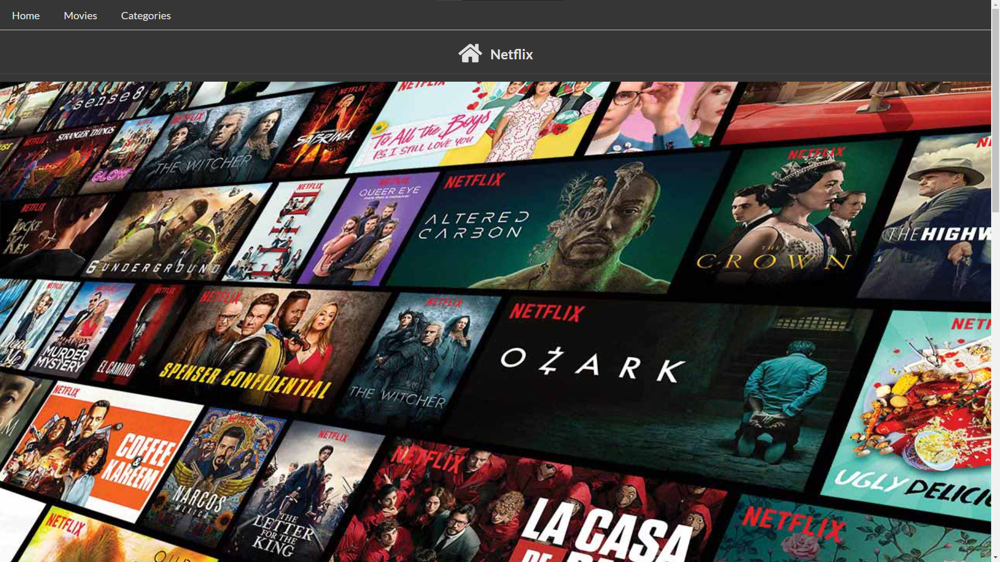
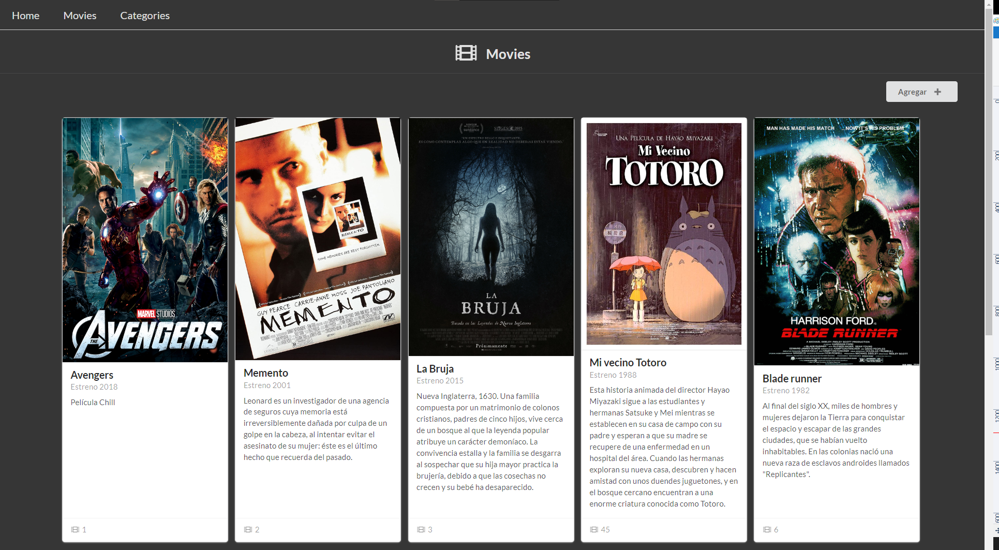
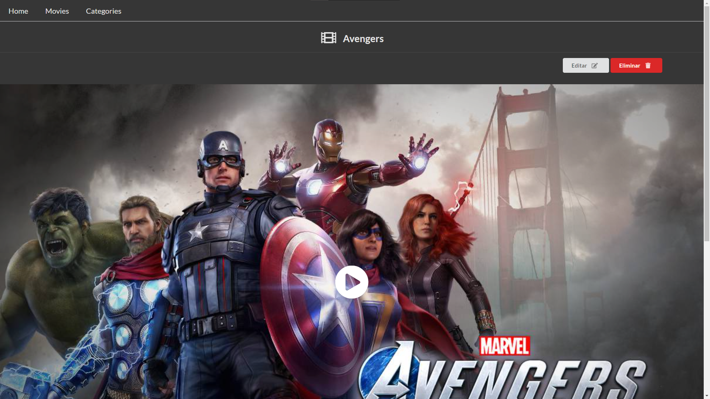
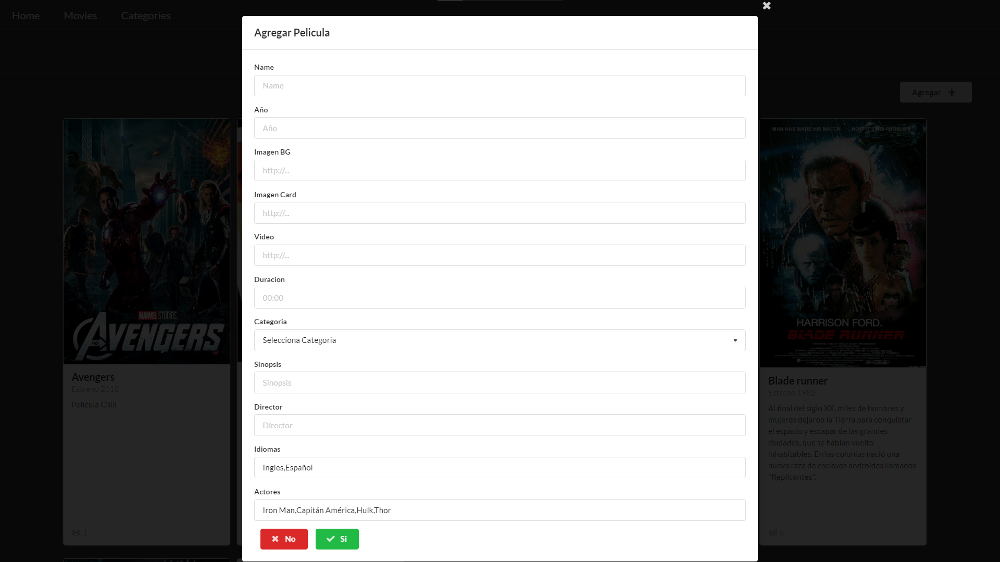
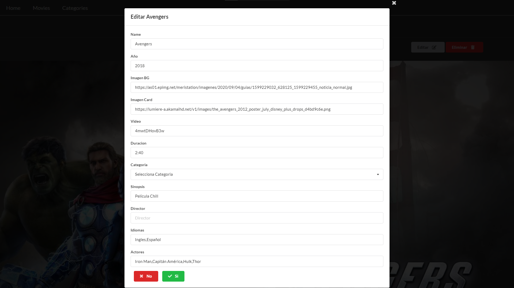
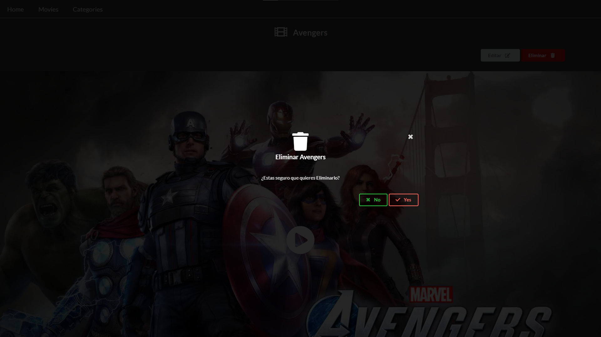

# DBII - Web App Project

## Ejecutar Proyecto:
### Pre-requisitos:
Tener instalado:

- Git

- Node.js

- Visual Studio Code (VSC)

### Dependencias:

- Clonar Repositorio `git clone https://github.com/DataBaseII/project-app.git`

- Abrir con  VSC el folder `project-app`

- Abrir una terminal

- Ejecutar `npm install`

### Levantar Server:

- Ejecutar `npm run start`

## Vistas

### Home

### Movies

### Movie

### Add Movie

### Edit Movie

### Delete Movie

### Developed by:

- Adrian Mendoza

- Jhulians Garcia

- Jose Carlos Lopez